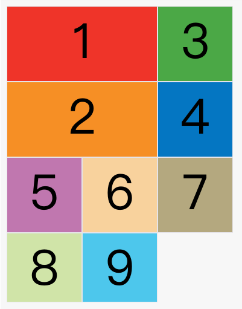

# **前端面试复习笔记**

## CSS部分：https://segmentfault.com/a/1190000013325778

### **盒模型**

​	所有 HTML 元素都可以视为方框。

​	CSS 框模型实质上是一个包围每个 HTML 元素的框。它包括：外边距、边框、内边距以及实际的内容。

### **标椎盒子模型**

​	margin+border+padding+width（content）

### **怪异盒模型**

​	margin+width（border+padding+content）

### **flex布局**

​	阮一峰https://www.ruanyifeng.com/blog/2015/07/flex-grammar.html

容器属性

- flex-direction：主轴排列方向
- flex-wrap：是否
- flex-flow： <flex-direction> || <flex-wrap>;
- justify-content：水平排序
- align-items：垂直排序
- align-content：多轴线整体

项目属性

- order：排序顺序。
- flex-grow：默认为0，不放大。为1将等分。
- flex-shrink：默认为1，空间不足将缩小。
- flex-basis：默认值auto，分配空间前，项目所占大小。
- flex： none | [ <'flex-grow'> <'flex-shrink'>? || <'flex-basis'> ]
- align-self：项目自身的垂直排序。

### **grid布局**

​	阮一峰http://www.ruanyifeng.com/blog/2019/03/grid-layout-tutorial.html

grid-template-columns、grid-template-rows定义列宽行高，百分比单位，repeat重复计算函数，fr关键字，auto设置长度。

```css
/* 3*3的网格 */
.container {
  display: grid;
  grid-template-columns: 100px 100px 100px; /*使用百分比 33.3% 33.3 % 33.3%*/
  grid-template-rows: 100px 100px 100px; /* repeat(3, 100px) */
}

/* repeat重复某种模式 */
.test {
    grid-template-columns: repeat(2, 100px 20px 80px);
}

/* auto-fill关键字，自动数量，尽可能多得填充空间 */
.test1 {
    grid-template-columns: repeat(auto-fill, 100px);
}

/* fr关键字 */
/* 为了方便表示比例关系，网格布局提供了fr关键字（fraction 的缩写，意为"片段"）。如果两列的宽度分别为1fr和2fr，就表示后者是前者的两倍。 */
.container {
  display: grid;
  grid-template-columns: 1fr 1fr;
}
/* minmax(min, max) 产生一个范围*/
.test {
	grid-template-columns: 1fr 1fr minmax(100px, 1fr);
}

/* auto设置长度 */
.test {
    grid-template-columns: 100px auto 100px;
}
```

`grid-row-gap`属性设置行与行的间隔（行间距），`grid-column-gap`属性设置列与列的间隔（列间距），grid-gap 简写。

```css
.container {
  grid-row-gap: 20px;
  grid-column-gap: 20px;
}

grid-gap: <grid-row-gap> <grid-column-gap>;

.container {
  grid-gap: 20px 20px;
}
```

grid-auto-flow: 默认row [dense]。项目在网格中的默认排序。dense声明表示尽可能填满行或列。

```css
grid-auto-flow: row dense;
```



`justify-items`属性设置单元格内容的水平位置（左中右），`align-items`属性设置单元格内容的垂直位置（上中下）。

```css
.container {
    justify-items: start | end | center | stretch;
    align-items: start | end | center | stretch;
    /* place-items属性是align-items属性和justify-items属性的合并简写形式。 */
	place-items: <align-items> <justify-items>;
}
```

```css
.container {
  justify-items: start;
}
```


`justify-content`属性是整个内容区域在容器里面的水平位置（左中右），`align-content`属性是整个内容区域的垂直位置（上中下）。

> ```css
> .container {
>   justify-content: start | end | center | stretch | space-around | space-between | space-evenly;
>   align-content: start | end | center | stretch | space-around | space-between | space-evenly;  
> }
> ```

对其容器起始边：


对于项目属性，指定项目具体位置

- `grid-column-start`属性：左边框所在的垂直网格线

- `grid-column-end`属性：右边框所在的垂直网格线

- `grid-row-start`属性：上边框所在的水平网格线

- `grid-row-end`属性：下边框所在的水平网格线

- ### justify-self 属性， align-self 属性， place-self 属性：项目排序

### **BFC是什么，有什么用**

https://blog.csdn.net/sinat_36422236/article/details/88763187

BFC块级格式上下文

创建条件：

- 根元素()
- 浮动元素（元素的 float 不是 none）
- 绝对定位元素（元素的 position 为 absolute 或 fixed）
- 行内块元素（元素的 display 为 inline-block）
- 表格单元格（元素的 display为 table-cell，HTML表格单元格默认为该值）
- 表格标题（元素的 display 为 table-caption，HTML表格标题默认为该值）
- 匿名表格单元格元素（元素的 display为 table、table-row、 table-row-group、table-header-group、table-footer-group（分别是HTML table、row、tbody、thead、tfoot的默认属性）或 inline-table）
- overflow 值不为 visible 的块元素 -弹性元素（display为 flex 或 inline-flex元素的直接子元素）
- 网格元素（display为 grid 或 inline-grid 元素的直接子元素） 等等。

作用：

（1）BFC垂直方向边距重叠

（2）BFC的区域不会与浮动元素的box重叠

（3）BFC是一个独立的容器，外面的元素不会影响里面的元素

（4）计算BFC高度的时候浮动元素也会参与计算

### **引入css的方式**

<link type="text/css" rel="styleSheet" href="path" />

<style> @import url('path'); </style>

​	区别：link属于html标签，优先加载css文件到页面；@import属于css2.1，先加载html再加载css文件。

### **css优先级**

​	1.最近的父类样式高于其他祖先样式

​	2.直接样式（行内样式）高于父类样式

​	3.优先关系：`优先级关系：内联样式 > ID 选择器 > 类选择器 = 属性选择器 = 伪类选择器 > 标签选择器 = 伪元素选择器`

​	!important声明的样式最高，如果优先级相同选择最后出现的（就近原则），继承得到的样式最低

​	4.计算选择符中 ID 选择器的个数（a），计算选择符中类选择器、属性选择器以及伪类选择器的个数之和（b），计算选择符中标签选择器和伪元素选择器的个数之和（c）。按 a、b、c 的顺序依次比较大小，大的则优先级高，相等则比较下一个。若最后两个的选择符中 a、b、c 都相等，则按照"就近原则"来判断。

```css
#con-id span {
    color: red;
}
div .con-span {
    color: blue;
}
```

### **水平垂直居中**

普通布局：

- 水平居中margin：0 auto；/ left：50%；margin-left：-width；/ transition:tanslate();
- line-height：height；

flex布局：

### **双飞翼布局**

### **品字布局**

### **CSS创建三角形、菱形**

​	设置border-top，border-left，border-right，border-bottom大小，结合transparent属性，并设置width和height为0。

```css
.rangle {
    width: 0;
    height: 0;
    border-top: 50px solid red;
    border-bottom: 50px solid blue;
    border-left: 50px solid gray;
    border-right: 50px solid yellow;
}
```


## **HTML部分**

### **H5语义化的意义**

- 易修改、易维护。
- 无障碍阅读支持。
- 搜索引擎友好，利于 SEO。
- 面向未来的 HTML，浏览器在未来可能提供更丰富的支持。

### **meta标签**

### **defer和async引入script脚本的区别**

​	async：表示应该立即开始下载脚本，但不能阻止其它页面动作，只对外部脚本有效。

​	defer：表示在文档解析和显示完成后再执行脚本是没问题的，只对外部脚本有效。


## JS部分

### **数据类型**

​	undefined， Boolean， Number， String ，BigInt， Symbol， null， Function， Object

​	BigInt：表示大于2^53 - 1的数，可以表示任意大的数。

### **判断各种类型**

​	typeof ：只能判断基本类型，对于结构类型和null不能进一步判断（typeof null === "object"，历史遗留问题对象底层二进制低三位000，null为全零）。

​	instanceof：判断结构类型，用于检测构造函数的 `prototype` 属性是否出现在某个实例对象的原型链上。               object instanceof contructor。（object.\_\_proto_\_.... === contructor.prototype）

​	判断Array可以使用Array.isArray()，Array.prototype.isPrototypeOf(obj)判断Array是否在obj的原型链上。

​	Object.prototype.toString.call(obj) == '[object Array]'，可以判断各种类型。

​	obj.constructor === Array，实例对象的构造函数

### **遍历相关**

### **闭包是什么，有什么用**	

​	闭包是有权访问另一个函数作用域中变量的函数。作用：setTimeout()，防抖与节流，封装私有变量。

​	使用时注意内存泄漏，手动令作用域变量为null。

### **函数防抖**

```js
function debounce(fn, delay) {
    let timer = null;
    return function() {
        let that = this;
        let args = arguments;
        clearTimeout(timer);
        timer = setTimeout(() => {
            // 精简写法fn.apply(this, arguments);不知道会有什么问题
            fn.apply(that, args);
        }, delay);
    }
}
```

```js
// 立即执行版
function debounce(fn, delay) {
    let timer = null;
    return function() {
        let that = this;
        let args = arguments;
        if (!timer) {
            fn.apply(that, args);
        }
        clearTimeout(timer);
        timer = setTimeout(() => {
            timer = null;
        }, delay);
    }
}
```


### **函数节流**

```js
function throttle(fn, delay) {
    let timer = null;
    return function() {
        if (timer) {
            
        } else {
            timer = setTimeout(() => {
                timer = null;
                fn.apply(this, arguments);
            }, delay);
        }
    }
}
```

```js
// 立即执行版
function throttle(fn, delay) {
    let timer = null;
    return function() {
        if (timer) {
            
        } else {
            fn.apply(this, arguments);
            timer = setTimeout(() => {
                timer = null;
            }, delay);
        }
    }
}
```

### **防抖与节流的结合版**

​	在防抖处理的同时，在一定的时间内给用户反馈

```js
function throttlePlus(fn, delay) {
    let timer = null;
    let pre = 0;
    return function() {
        let that = this;
        let args = arguments;
        let now = new Date();
        if (now - pre >= delay) {
            pre = now;
            fn.apply(that, args);
        }
        clearTimeout(timer);
        timer = setTimeout(() => {
            timer = null;
            fn.apply(that, args);
        }, delay);
    }
}
```


### **箭头函数**

​	箭头函数没有自己的this，arguments，super或new.target，不能用作构造函数。箭头函数没有`prototype`属性。

箭头函数不会创建自己的`this,它只会从自己的作用域链的上一层继承this`。因此，在下面的代码中，传递给`setInterval`的函数内的`this`与封闭函数中的`this`值相同：

```
function Person(){
  this.age = 0;

  setInterval(() => {
    this.age++; // |this| 正确地指向 p 实例
  }, 1000);
}

var p = new Person();
```

### **this指向**

​	https://juejin.cn/post/6844903488304971789

​	指向调用的地方；箭头函数捕获上下文的this作为自己的this；call和apply在传入对象;`bind()` 方法创建一个新的函数，在 `bind()` 被调用时，这个新函数的 `this` 被指定为 `bind()` 的第一个参数，而其余参数将作为新函数的参数，供调用时使用。

### **new的原理与实现**

​	1.新生成对象
​	2.链接到原型
​	3.绑定this
​	4.返回新对象

```js
function create(){
    //定义空对象
    let obj = {};
    //取出参数列表的第一个参数（构造函数）
    let Con = [].shift.call(arguments);
    //手动指正obj的构造函数为Con（链接原型）
    obj.__proto__ = Con.prototype;
    //调用Con，改变this为obj，传入剩余参数arguments
    let result = Con.apply(obj,arguments);
    //考虑到Con函数中有return的原因，需要对result进行判断
    return result instanceof Object ? result : obj
}
```

### **怎么实现继承**

​	ES6有extends

```js
// 寄生组合继承
function Parent5 () {
    this.name = 'parent5';
    this.play = [1, 2, 3];
}
function Child5() {
    // 继承父类的属性
    Parent5.call(this); 
    this.type = 'child5';
  }
// 继承父类的方法
Child5.prototype = Object.create(Parent5.prototype);
// 修改构造函数指向
Child5.prototype.constructor = Child5;
```

### **实现数组扁平化**

​	flat方法(返回一个扁平化的数组，多重的不行)，递归

```js
function solution(arr) {
    let res = [];
    dfs(arr);
    return res;

    function dfs(arr) {
        for (let i = 0; i < arr.length; i++) {
            if (Array.isArray(arr[i])) {
                dfs(arr[i]);
            } else {
                res.push(arr[i]);
            }
        }
    }
}
```

### **实现instanceof**

```js
function inst(left, right) {
    const baseType = ['number', 'string', 'boolean', 'undefined', 'symbol', 'null']
	if(baseType.includes(typeof left)) return false
    let cur = left.__proto__;
    while (cur !== null) {
        if (cur === right.prototype) {
            return true;
        }
        cur = cur.__proto__;
    }
    return false;
}
```

### **关于异步的认识**

​	以往的异步setTimeout搭配回调函数。

​	Promise（期约）， async和await关键字。

### **promise是什么**

https://es6.ruanyifeng.com/#docs/promise

​	三种状态：pending，fulfilled/resolved，rejected。

​	实例化promise对象的同步代码会立即执行，异步代码进入异步队列。

基本用法

```
const promise = new Promise(function(resolve, reject) {
  // ... some code

  if (/* 异步操作成功 */){
    resolve(value);
  } else {
    reject(error);
  }
});

promise.then(function(value) {
  // success
}, function(error) {
  // failure
});
// 或者 ///////////
promise.then(function(value) {
  // success
}).catch(function(err) {
	// error
});
```

`finally()`方法用于指定不管 Promise 对象最后状态如何，都会执行的操作。`finally`方法总是会返回原来的值。

```js
promise
.then(result => {···})
.catch(error => {···})
.finally(() => {···});

// resolve 的值是 undefined
Promise.resolve(2).then(() => {}, () => {})

// resolve 的值是 2
Promise.resolve(2).finally(() => {})

// reject 的值是 undefined
Promise.reject(3).then(() => {}, () => {})

// reject 的值是 3
Promise.reject(3).finally(() => {})
```

`Promise.all()`方法用于将多个 Promise 实例，包装成一个新的 Promise 实例。只有全部resolved才resolved，只要一个rejected就为rejected。

```js
const p = Promise.all([p1, p2, p3]);
// p1 p2 p3 返回值组成的数组
p.then((arr) => {
    // success
}).catch((err) => {
    // error
});
```

`Promise.any()`跟`Promise.race()`方法很像，只有一点不同，就是不会因为某个 Promise 变成`rejected`状态而结束。只要一个是fulfilled就为fulfill

`Promise.race()`方法同样是将多个 Promise 实例，包装成一个新的 Promise 实例。只要`p1`、`p2`、`p3`之中有一个实例率先改变状态，`p`的状态就跟着改变。那个率先改变的 Promise 实例的返回值，就传递给`p`的回调函数。

```js
const p = Promise.race([p1, p2, p3]);

//// 如果fetch没在5秒内返回，则reject
const p = Promise.race([
  fetch('/resource-that-may-take-a-while'),
  new Promise(function (resolve, reject) {
    setTimeout(() => reject(new Error('request timeout')), 5000)
  })
]);

p
.then(console.log)
.catch(console.error);
```

有时需要将现有对象转为 Promise 对象，`Promise.resolve()`方法就起到这个作用。

```js
Promise.resolve('foo')
// 等价于
new Promise(resolve => resolve('foo'))
```

**Promise.resolve()接受的参数分四种情况：**

**（1）参数是一个 Promise 实例**

如果参数是 Promise 实例，那么`Promise.resolve`将不做任何修改、原封不动地返回这个实例。

**（2）参数是一个`thenable`对象**

`thenable`对象指的是具有`then`方法的对象，比如下面这个对象。

```javascript
let thenable = {
  then: function(resolve, reject) {
    resolve(42);
  }
};
```

`Promise.resolve()`方法会将这个对象转为 Promise 对象，然后就立即执行`thenable`对象的`then()`方法。

```javascript
let thenable = {
  then: function(resolve, reject) {
    resolve(42);
  }
};

let p1 = Promise.resolve(thenable);
p1.then(function (value) {
  console.log(value);  // 42
});
```

上面代码中，`thenable`对象的`then()`方法执行后，对象`p1`的状态就变为`resolved`，从而立即执行最后那个`then()`方法指定的回调函数，输出42。

**（3）参数不是具有`then()`方法的对象，或根本就不是对象**

如果参数是一个原始值，或者是一个不具有`then()`方法的对象，则`Promise.resolve()`方法返回一个新的 Promise 对象，状态为`resolved`。

```javascript
const p = Promise.resolve('Hello');

p.then(function (s) {
  console.log(s)
});
// Hello
```

上面代码生成一个新的 Promise 对象的实例`p`。由于字符串`Hello`不属于异步操作（判断方法是字符串对象不具有 then 方法），返回 Promise 实例的状态从一生成就是`resolved`，所以回调函数会立即执行。`Promise.resolve()`方法的参数，会同时传给回调函数。

**（4）不带有任何参数**

`Promise.resolve()`方法允许调用时不带参数，直接返回一个`resolved`状态的 Promise 对象。

所以，如果希望得到一个 Promise 对象，比较方便的方法就是直接调用`Promise.resolve()`方法。

```javascript
const p = Promise.resolve();

p.then(function () {
  // ...
});
```

上面代码的变量`p`就是一个 Promise 对象。

需要注意的是，立即`resolve()`的 Promise 对象，是在本轮“事件循环”（event loop）的结束时执行，而不是在下一轮“事件循环”的开始时。

```javascript
setTimeout(function () {
  console.log('three');
}, 0);

Promise.resolve().then(function () {
  console.log('two');
});

console.log('one');

// one
// two
// three
```

上面代码中，`setTimeout(fn, 0)`在下一轮“事件循环”开始时执行，`Promise.resolve()`在本轮“事件循环”结束时执行，`console.log('one')`则是立即执行，因此最先输出。

**搭配async和await关键字**

```js
function sleep(ms) {
    return new Promise(function(resolve, reject) {
        setTimeout(resolve,ms);
    })
}
async function handle(){
    console.log("AAA")
    await sleep(5000)
    console.log("BBB")
}

handle();

// AAA
// BBB (5000ms后)
```


### **手写promise**

```js
class Promise {
    callbacks = [];
    state = 'pending';//增加状态
    value = null;//保存结果
    constructor(fn) {
        fn(this._resolve.bind(this));
    }
    then(onFulfilled) {
        if (this.state === 'pending') {//在resolve之前，跟之前逻辑一样，添加到callbacks中
            // this.callbacks.push(onFulfilled);
        } else {//在resolve之后，直接执行回调，返回结果了
            onFulfilled(this.value);
        }
        return this;
    }
    _resolve(value) {
        this.state = 'fulfilled';//改变状态
        this.value = value;//保存结果
        // this.callbacks.forEach(fn => fn(value));
    }
}
```

### **浅拷贝与深拷贝**

```js
// 浅拷贝

let b = {...a}; 

// 深拷贝
var deepCopy = (obj) => {
    var ret = {}
    for (var key in obj) {
        var value = obj[key]
        ret[key] = typeof value === 'object' ? deepCopy(value) : value
    }
    return ret
}
```

### **import与export**

### **在ES5如何实现ES6的class**

```js
var Hello = (function () {
    // constructor
    function Hello(x) {
        this.x = x;
    }
    Hello.prototype.greet = function () {
        console.log("Hello, " + this.x);
    };
    return Hello;
}());
// 不写成自执行 则 world.__proto__ === Hello.prototype 为false
var world = new Hello("world");

```


## **ES6相关**

### 	**新增let和const**

​		let声明块级作用域变量，const声明常量必须初始化。

### 	**解构赋值**

​		解构赋值是对赋值运算符的扩展。

​		他是一种针对数组或者对象进行模式匹配，然后对其中的变量进行赋值。

​		**数组模型**

```js
// 基本
let [a, b, c] = [1, 2, 3];
// a = 1
// b = 2
// c = 3
// 可嵌套
let [a, [[b], c]] = [1, [[2], 3]];
// a = 1
// b = 2
// c = 3
// 可忽略
let [a, , b] = [1, 2, 3];
// a = 1
// b = 3
// 不完全解构
let [a = 1, b] = []; // a = 1, b = undefined
// 剩余运算符
let [a, ...b] = [1, 2, 3];
//a = 1
//b = [2, 3]
// 字符串等
let [a, b, c, d, e] = 'hello';
// a = 'h'
// b = 'e'
// c = 'l'
// d = 'l'
// e = 'o'
// 解构默认值
let [a = 2] = [undefined]; // a = 2
// 当解构模式有匹配结果，且匹配结果是 undefined 时，会触发默认值作为返回结果。
let [a = 3, b = a] = [];     // a = 3, b = 3
let [a = 3, b = a] = [1];    // a = 1, b = 1
let [a = 3, b = a] = [1, 2]; // a = 1, b = 2
```

​		**对象模式**

```js
基本

let { foo, bar } = { foo: 'aaa', bar: 'bbb' };
// foo = 'aaa'
// bar = 'bbb'
 
let { baz : foo } = { baz : 'ddd' };
// foo = 'ddd'
可嵌套可忽略

let obj = {p: ['hello', {y: 'world'}] };
let {p: [x, { y }] } = obj;
// x = 'hello'
// y = 'world'
let obj = {p: ['hello', {y: 'world'}] };
let {p: [x, {  }] } = obj;
// x = 'hello'
不完全解构

let obj = {p: [{y: 'world'}] };
let {p: [{ y }, x ] } = obj;
// x = undefined
// y = 'world'
剩余运算符

let {a, b, ...rest} = {a: 10, b: 20, c: 30, d: 40};
// a = 10
// b = 20
// rest = {c: 30, d: 40}
解构默认值

let {a = 10, b = 5} = {a: 3};
// a = 3; b = 5;
let {a: aa = 10, b: bb = 5} = {a: 3};
// aa = 3; bb = 5;
```

### 	**Map和Set**

​		**`Map`** 对象保存键值对，并且能够记住键的原始插入顺序。任何值(对象或者[原始值](https://developer.mozilla.org/zh-CN/docs/Glossary/Primitive)) 都可以作为一个键或一个值。

​		**`Set`** 对象允许你存储任何类型的唯一值，无论是[原始值](https://developer.mozilla.org/zh-CN/docs/Glossary/Primitive)或者是对象引用。（去重）

​		**`WeakMap`**和Map类似，不过其中的键是弱引用，且键必须是对象。

​		**`WeakSet`** 对象允许你将*弱保持对象*存储在一个集合中。

### 	**Reflect和Proxy**

​		Proxy 与 Reflect 是 ES6 为了操作对象引入的 API 。

​		Proxy 可以对目标对象的读取、函数调用等操作进行拦截，然后进行操作处理。它不直接操作对象，而是像代理模式，通过对象的代理对象进行操作，在进行这些操作时，可以添加一些需要的额外操作。

​		Reflect 可以用于获取目标对象的行为，它与 Object 类似，但是更易读，为操作对象提供了一种更优雅的方式。它的方法与 Proxy 是对应的。

#### 	**Proxy**

​	一个 Proxy 对象由两个部分组成： target 、 handler 。在通过 Proxy 构造函数生成实例对象时，需要提供这两个参数。 target 即目标对象， handler 是一个对象，声明了代理 target 的指定行为

​	

```js
let target = {
    name: 'Tom',
    age: 24
}
let handler = {
    // receiver 表示原始操作行为所在对象，一般是 Proxy 实例本身。
    get: function(target, key, receiver) {
        console.log('getting '+key);
        return target[key]; // 不是target.key
    },
    // 如果目标对象自身的某个属性，不可写且不可配置，那么set方法将不起作用。
    set: function(target, key, value, receiver) {
        console.log('setting '+key);
        target[key] = value;
    }
    // apply(target, ctx, args)
//用于拦截函数的调用、call 和 reply 操作。target 表示目标对象，ctx 表示目标对象上下文，args 表示目标对象的参数数组。
    // has(target, propKey)
// 用于拦截 HasProperty 操作，即在判断 target 对象是否存在 propKey 属性时，会被这个方法拦截。此方法不判断一个属性是对象自身的属性，还是继承的属性。
    // construct(target, args)
// 用于拦截 new 命令。返回值必须为对象。
    // deleteProperty(target, propKey)
// 用于拦截 delete 操作，如果这个方法抛出错误或者返回 false ，propKey 属性就无法被 delete 命令删除。
    // defineProperty(target, propKey, propDesc)
// 用于拦截 Object.definePro若目标对象不可扩展，增加目标对象上不存在的属性会报错；若属性不可写或不可配置，则不能改变这些属性。
}
let proxy = new Proxy(target, handler)
proxy.name     // 实际执行 handler.get
proxy.age = 25 // 实际执行 handler.set
// getting name
// setting age
// 25
```

#### 	**Reflect**


### 	**迭代器**

iterator

**Symbol.iterator** 为每一个对象定义了默认的迭代器。该迭代器可以被 `for...of` 循环使用。

可迭代对象

- [`Array.prototype[@@iterator]()`](https://developer.mozilla.org/zh-CN/docs/Web/JavaScript/Reference/Global_Objects/Array/@@iterator)
- [`TypedArray.prototype[@@iterator]()`](https://developer.mozilla.org/zh-CN/docs/Web/JavaScript/Reference/Global_Objects/TypedArray/@@iterator)
- [`String.prototype[@@iterator]()`](https://developer.mozilla.org/zh-CN/docs/Web/JavaScript/Reference/Global_Objects/String/@@iterator)
- [`Map.prototype[@@iterator]()`](https://developer.mozilla.org/zh-CN/docs/Web/JavaScript/Reference/Global_Objects/Map/@@iterator)
- [`Set.prototype[@@iterator]()`](https://developer.mozilla.org/zh-CN/docs/Web/JavaScript/Reference/Global_Objects/Set/@@iterator)

我们可以像下面这样创建自定义的迭代器：

```js
var myIterable = {}
myIterable[Symbol.iterator] = function* () {
    yield 1;
    yield 2;
    yield 3;
};
[...myIterable] // [1, 2, 3]

// 可迭代对象，for ... of的内部实现
let aa = [1,2,3,4];
let iter = aa[Symbol.iterator]();
let temp = iter.next();
while(!temp.done) {
    console.log(temp.value);
    temp = iter.next();
}
```

### 	**Promise**

### **Generator**

https://www.runoob.com/w3cnote/es6-generator.html

像Python的生成器

Generator 有两个区分于普通函数的部分：

- 一是在 function 后面，函数名之前有个 * ；
- 函数内部有 yield 表达式。

```js
function* func(){
    console.log("one");
    yield '1';
    console.log("two");
    yield '2'; 
    console.log("three");
    return '3';
}
// 执行
f.next();
// one
// {value: "1", done: false}
 
f.next();
// two
// {value: "2", done: false}
 
f.next();
// three
// {value: "3", done: true}
 
f.next();
// {value: undefined, done: true}
```

**next传参，和return**

当 next 传入参数的时候，该参数会作为上一步yield的(第一个next传参改怎么获取呢？).

return 方法返回给定值，并结束遍历 Generator 函数。

return 方法提供参数时，返回该参数；不提供参数时，返回 undefined 。

```js
function* func(){
    console.log("one");
    let x = yield '1';
    console.log(x)
    console.log("two");
    let y = yield '2'; 
    let z = console.log("three");
    return '3';
}
// 执行
f.next();
// one
// {value: "1", done: false}
 
f.next(88);
// 88
// two
// {value: "2", done: false}
 
f.return(99);
// {value: "99", done: true}
```

**yeild*表达式**

yield* 表达式表示 yield 返回一个遍历器对象，用于在 Generator 函数内部，调用另一个 Generator 函数。

```js
function* callee() {
    console.log('callee: ' + (yield));
}
function* caller() {
    while (true) {
        yield* callee();
    }
}
const callerObj = caller();
callerObj.next();
// {value: undefined, done: false}
callerObj.next("a");
// callee: a
// {value: undefined, done: false}
callerObj.next("b");
// callee: b
// {value: undefined, done: false}
 
// 等同于
function* caller() {
    while (true) {
        for (var value of callee) {
          yield value;
        }
    }
}
```


### **async函数**

https://www.runoob.com/w3cnote/es6-async.html

```
async function name([param[, param[, ... param]]]) { statements }
```

- name: 函数名称。
- param: 要传递给函数的参数的名称。
- statements: 函数体语句。

async 函数返回一个 Promise 对象，可以使用 then 方法添加回调函数。

```js
async function helloAsync(){
    return "helloAsync";
  }
  
console.log(helloAsync())  // Promise {<resolved>: "helloAsync"}
 
helloAsync().then(v=>{
   console.log(v);         // helloAsync
})
```

async 函数中可能会有 await 表达式，async 函数执行时，如果遇到 await 就会先暂停执行 ，等到触发的异步操作完成后，恢复 async 函数的执行并返回解析值。

await 关键字仅在 async function 中有效。如果在 async function 函数体外使用 await ，你只会得到一个语法错误。

```js
function testAwait(val){
    return new Promise((resolve) => {
        setTimeout(function(){
           console.log("testAwait");
           resolve(val);
        }, 1000);
    });
 }
  
 async function helloAsync(){
     // let a = await testAwait('ppp');
    await testAwait('ppp').then(res => console.log(res));
    console.log("helloAsync");
  }
 helloAsync();
// testAwait
// helloAsync
```


## 跨域

### **同源策略**

​	如果两个 URL 的 [protocol](https://developer.mozilla.org/zh-CN/docs/Glossary/Protocol)、[port (en-US)](https://developer.mozilla.org/en-US/docs/Glossary/Port) (如果有指定的话)和 [host](https://developer.mozilla.org/zh-CN/docs/Glossary/Host) 都相同的话，则这两个 URL 是同源。

​	host为域名。

### **CORS**

http://www.ruanyifeng.com/blog/2016/04/cors.html

​	"跨域资源共享"（Cross-origin resource sharing）。

​	浏览器将CORS请求分成两类：简单请求（simple request）和非简单请求（not-so-simple request）。

只要同时满足以下两大条件，就属于简单请求。

> （1) 请求方法是以下三种方法之一：
>
> - HEAD
> - GET
> - POST
>
> （2）HTTP的头信息不超出以下几种字段：
>
> - Accept
> - Accept-Language
> - Content-Language
> - Last-Event-ID
> - Content-Type：只限于三个值`application/x-www-form-urlencoded`、`multipart/form-data`、`text/plain`

这是为了兼容表单（form），因为历史上表单一直可以发出跨域请求。AJAX 的跨域设计就是，只要表单可以发，AJAX 就可以直接发。

**简单请求**

​	简单请求在请求头会添加一个Origin字段，值为（协议 + 域名 + 端口）三元组。服务器根据这个值决定是否接受这个请求。服务端设置`Access-Control-Allow-Origin`字段。

​	如果`Origin`指定的域名在许可范围内，服务器返回的响应，会多出几个头信息字段。

> ```http
> Access-Control-Allow-Origin: http://api.bob.com
> Access-Control-Allow-Credentials: true
> Access-Control-Expose-Headers: FooBar
> Content-Type: text/html; charset=utf-8
> ```

**（1）Access-Control-Allow-Origin**

该字段是必须的。它的值要么是请求时`Origin`字段的值，要么是一个`*`，表示接受任意域名的请求。

**（2）Access-Control-Allow-Credentials**

该字段可选。它的值是一个布尔值，表示是否允许发送Cookie。默认情况下，Cookie不包括在CORS请求之中。设为`true`，即表示服务器明确许可，Cookie可以包含在请求中，一起发给服务器。这个值也只能设为`true`，如果服务器不要浏览器发送Cookie，删除该字段即可。

​	设置这个时前端要设置ajax的withCredentials为true

```javascript
var xhr = new XMLHttpRequest();
xhr.withCredentials = true;
```

​	并且要发送cookie时，cookie要遵守同源策略，Access-Control-Allow-Origin不能为*号，同域名才能上传。

**（3）Access-Control-Expose-Headers**

该字段可选。CORS请求时，`XMLHttpRequest`对象的`getResponseHeader()`方法只能拿到6个基本字段：`Cache-Control`、`Content-Language`、`Content-Type`、`Expires`、`Last-Modified`、`Pragma`。如果想拿到其他字段，就必须在`Access-Control-Expose-Headers`里面指定。上面的例子指定，`getResponseHeader('FooBar')`可以返回`FooBar`字段的值。

**非简单请求**

​	正式请求前进行预请求。向服务器查询当前域是否合法，以及支持那些HTTP类型和头信息。	

​	预请求使用OPTION方法，具有**Origin**头。以及

**（1）Access-Control-Request-Method**

该字段是必须的，用来列出浏览器的CORS请求会用到哪些HTTP方法。

**（2）Access-Control-Request-Headers**

该字段是一个逗号分隔的字符串，指定浏览器CORS请求会额外发送的头信息字段。

服务器回应的其他CORS相关字段如下。

> ```http
> Access-Control-Allow-Methods: GET, POST, PUT
> Access-Control-Allow-Headers: X-Custom-Header
> Access-Control-Allow-Credentials: true
> Access-Control-Max-Age: 1728000
> ```

**（1）Access-Control-Allow-Methods**

该字段必需，它的值是逗号分隔的一个字符串，表明服务器支持的所有跨域请求的方法。注意，返回的是所有支持的方法，而不单是浏览器请求的那个方法。这是为了避免多次"预检"请求。

**（2）Access-Control-Allow-Headers**

如果浏览器请求包括`Access-Control-Request-Headers`字段，则`Access-Control-Allow-Headers`字段是必需的。它也是一个逗号分隔的字符串，表明服务器支持的所有头信息字段，不限于浏览器在"预检"中请求的字段。

**（3）Access-Control-Allow-Credentials**

该字段与简单请求时的含义相同。

**（4）Access-Control-Max-Age**

该字段可选，用来指定本次预检请求的有效期，单位为秒。上面结果中，有效期是20天（1728000秒），即允许缓存该条回应1728000秒（即20天），在此期间，不用发出另一条预检请求。

一旦服务器通过了"预检"请求，以后每次浏览器正常的CORS请求，就都跟简单请求一样，会有一个`Origin`头信息字段。服务器的回应，也都会有一个`Access-Control-Allow-Origin`头信息字段。

### **CORS和JSONP的区别及优缺点**

​	CORS能解决大多数跨域问题

​	JSONP只支持get请求，兼容性好（支持老式浏览器，向不支持CORS的服务器通信）

### **Json Web Token**

http://www.ruanyifeng.com/blog/2018/07/json_web_token-tutorial.html

跨域认证。JWT 的原理是，服务器认证以后，生成一个 JSON 对象，发回给用户，就像下面这样。

> ```js
> {
>   "姓名": "张三",
>   "角色": "管理员",
>   "到期时间": "2018年7月1日0点0分"
> }
> ```

以后，用户与服务端通信的时候，都要发回这个 JSON 对象。服务器完全只靠这个对象认定用户身份。为了防止用户篡改数据，服务器在生成这个对象的时候，会加上签名。

JWT分三部分：header（头），payload（荷载），signature（签名/用的是摘要算法，为啥叫签名）

```js
{type:声明类型，alg:签名/摘要算法}.{存储用户信息，不要存敏感信息}.对前面两部分进行base64转码后的摘要
```

服务器就不保存任何 session 数据了，也就是说，服务器变成无状态了，从而比较容易实现扩展。

## Vue部分

### **什么是MVVM**

​	MVVM分为三个部分：分别是M（Model，模型层 ），V（View，视图层），VM（ViewModel，V与M连接的桥梁，也可以看作为控制器）
 M：模型层，主要负责业务数据相关**（数据data）**；
 V：视图层，顾名思义，负责视图相关，细分下来就是html+css层（**html模板**）；
 VM：V与M沟通的桥梁，负责监听M或者V的修改，是实现MVVM双向绑定的要点**（vm = new Vue()）**；

MVVM支持双向绑定，意思就是当M层数据进行修改时，VM层会监测到变化，并且通知V层进行相应的修改，反之修改V层则会通知M层数据进行修改，以此也实现了视图与模型层的相互解耦；

### **Vue基础部分**

#### **生命周期**

​	beforeCreate,created,beforeMount,mounted,,beforeUpdate,updated,beforeDestroy,destroyed


#### **对路由的了解**

​	单页应用不仅仅是在页面交互是无刷新的，连页面跳转都是无刷新的，为了实现单页应用，所以就有了前端路由。

#### **路由hash和history区别**

​	`vue-router` 默认 **hash 模式** —— 使用 URL 的 hash 来模拟一个完整的 URL，于是当 URL 改变时，页面不会重新加载。

​	**hostory模式**：这种模式充分利用 `history.pushState` API 来完成 URL 跳转而无须重新加载页面。（需要后台配置，因为访问一个路由组件不一定代表有这个资源）

#### **v-if和v-show的区别**

​	v-if：真正的销毁与重建。

​	v-show：仅仅改变display属性。

​	一般来说，`v-if` 有更高的切换开销，而 `v-show` 有更高的初始渲染开销。因此，如果需要非常频繁地切换，则使用 `v-show` 较好；如果在运行时条件很少改变，则使用 `v-if` 较好。

#### **Vue.use()**

​	完成组件绑定。模块的index.js中有个install方法完成模块组件与Vue的绑定。

```js
install:function(Vue){
    Vue.component('Loading',LoadingComponent)
}
```

#### **Vue.set()**

​	如果在实例创建之后添加新的属性到实例上，它不会触发视图更新。使用Vue.set()方法可以让Vue监听到，并更新视图

​	Vue.set( target, key, value ) 或 this.$set(target, key, value)

- target：要更改的数据源(可以是对象或者数组)
- key：要更改(增加)的具体数据
- value ：重新赋的值

#### **$nextTick()**

​	在下次 DOM 更新循环结束之后执行延迟回调。在修改数据之后立即使用这个方法，获取更新后的 DOM。

​	项目中想在改变DOM元素的数据后基于新的DOM做点什么时，对新的DOM一系列的js操作都要放进`Vue.nextTick()`的回调函数中（即更改数据后当你想立即使用js操作新的视图的时候需要使用它，来实现DOM数据更新后延迟执行后续代码）

#### **组件通信**

​	props的父子组件通信

​	$emit自定义事件

​	vue-bus

​	Vuex

#### **vuex 和 eventbus 优缺点**

vuex维护代价大，更加易于调试与管理；eventbus简单但项目状态变多会难以维护

**使用vuex的情况**

- 对于层级比较深的多个组件交互时，使用props和emit会很麻烦。
- eventbus是事件传递，两个兄弟组件a，b之间，若是在a中触发事件时，b为创建会很尬。

**使用eventbus的情况**

- 小部分的数据交互，以及简单通信（浅层通信）。
- 用于父子，或祖先以其子。因为父层总是很少销毁，不需要频繁的解绑与绑定。

#### **watch和computed的区别**

https://www.cnblogs.com/jiajialove/p/11327945.html

​	**watch**

​			1. 不支持缓存，数据变，直接会触发相应的操作；

​			2.watch支持异步；

​			3.监听的函数接收两个参数，第一个参数是最新的值；第二个参数是输入之前的值；

4. 当一个属性发生变化时，需要执行对应的操作；一对多；

5. 监听数据必须是data中声明过或者父组件传递过来的props中的数据，当数据变化时，触发其他操作，函数有两个参数，

   　　immediate：组件加载立即触发回调函数执行，

      　　deep: 深度监听，为了发现**对象内部值**的变化，复杂类型的数据时使用，例如数组中的对象内容的改变，注意监听数组的变动不需要这么做。注意：deep无法监听到数组的变动和对象的新增，参考vue数组变异,只有以响应式的方式触发才会被监听到。

​	**computed** 是基于它的依赖缓存，只有相关依赖发生改变时才会重新取值。

1. 支持缓存，只有依赖数据发生改变，才会重新进行计算

2. 不支持异步，当computed内有异步操作时无效，无法监听数据的变化
3. computed 属性值会默认走缓存，计算属性是基于它们的响应式依赖进行缓存的，也就是基于data中声明过或者父组件传递的props中的数据通过计算得到的值

4. 如果一个属性是由其他属性计算而来的，这个属性依赖其他属性，是一个多对一或者一对一，一般用computed
5. 如果computed属性属性值是函数，那么默认会走get方法；函数的返回值就是属性的属性值；在computed中的，属性都有一个get和一个set方法，当数据变化时，调用set方法。

#### **mixins**

混入的对象相当于拷贝了一份原对象，命名冲突采用引入组件的。

整体来讲相当于当前组件和引入的mixins组件合并，进行了拓展。

**缺点：**（其实这就是它的特点不懂是不是缺点）

- 命名冲突
- 隐含的依赖关系(mixin和使用它的组件之间没有层次关系。组件里的变量名称修改后，mixin里没改)

#### **关于Vuex**

https://vuex.vuejs.org/zh/

Vuex 是一个专为 Vue.js 应用程序开发的**状态管理模式**。它采用集中式存储管理应用的所有组件的状态，并以相应的规则保证状态以一种可预测的方式发生变化。

##### State

状态

##### Getters

可以认为是计算属性

```js
const store = new Vuex.Store({
  state: {
    todos: [
      { id: 1, text: '...', done: true },
      { id: 2, text: '...', done: false }
    ]
  },
  getters: {
    doneTodos: state => {
      return state.todos.filter(todo => todo.done)
    }
  }
})
```

##### Mutations

更改 Vuex 的 store 中的状态的唯一方法是提交 mutation。

每个 mutation 都有一个字符串的 **事件类型 (type)** 和 一个 **回调函数 (handler)**。这个回调函数就是我们实际进行状态更改的地方，并且它会接受 state 作为第一个参数：

```js
const store = new Vuex.Store({
  state: {
    count: 1
  },
  mutations: {
    increment (state) {
      // 变更状态
      state.count++
    }
  }
})
```

”要唤醒一个 mutation handler，你需要以相应的 type 调用 **store.commit** 方法：

```js
store.commit('increment')
```

​	**Mutation 必须是同步函数**

​	异步Mutation不会对数据造成丢失和其他影响，要求是同步函数更多是为了规范。

​	使用异步时导致工具devtools不能正常追踪状态。

##### Actions

Action 类似于 mutation，不同在于：

- Action 提交的是 mutation，而不是直接变更状态。
- Action 可以包含任意异步操作。

```js
const store = new Vuex.Store({
  state: {
    count: 0
  },
  mutations: {
    increment (state) {
      state.count++
    }
  },
  actions: {
    increment (context) {
      context.commit('increment')
    }
  }
})
```

​	**分发 Action**

​	Action 通过 `store.dispatch` 方法触发：

```js
store.dispatch('increment')
```

`store.dispatch` 可以处理被触发的 action 的处理函数返回的 Promise，并且 `store.dispatch` 仍旧返回 Promise：

```js
actions: {
  actionA ({ commit }) {
    return new Promise((resolve, reject) => {
      setTimeout(() => {
        commit('someMutation')
        resolve()
      }, 1000)
    })
  }
}
```

现在你可以：

```js
store.dispatch('actionA').then(() => {
  // ...
})
```

##### Modules

由于使用单一状态树，应用的所有状态会集中到一个比较大的对象。当应用变得非常复杂时，store 对象就有可能变得相当臃肿。

Vuex 允许我们将 store 分割成**模块（module）**。每个模块拥有自己的 state、mutation、action、getter、甚至是嵌套子模块——从上至下进行同样方式的分割：

```js
const moduleA = {
  state: () => ({ ... }),
  mutations: { ... },
  actions: { ... },
  getters: { ... }
}

const moduleB = {
  state: () => ({ ... }),
  mutations: { ... },
  actions: { ... }
}

const store = new Vuex.Store({
  modules: {
    a: moduleA,
    b: moduleB
  }
})

store.state.a // -> moduleA 的状态
store.state.b // -> moduleB 的状态
```

### **Vue源码部分https://juejin.cn/post/6844904084374290446**

#### **Vue2和Vue3双向绑定原理**

vue数据双向绑定是通过数据劫持结合发布者-订阅者模式的方式来实现的

​	**vue2**使用发布/订阅模式，重写get和set方法，利用Object.defineProperty进行数据劫持。

​	compile可以先不用管，因为只是修改虚拟DOM的值，操作完成，再进行diff，然后渲染

​		

```js
function defineReactive(data, key, val) {
    observe(val); // 递归遍历所有子属性
    var dep = new Dep(); 
    Object.defineProperty(data, key, {
        enumerable: true,
        configurable: true,
        get: function() {
            if (是否需要添加订阅者) {
                dep.addSub(watcher); // 在这里添加一个订阅者
            }
            return val;
        },
        set: function(newVal) {
            if (val === newVal) {
                return;
            }
            val = newVal;
            console.log('属性' + key + '已经被监听了，现在值为：“' + newVal.toString() + '”');
            dep.notify(); // 如果数据变化，通知所有订阅者
        }
    });
}
 
function Dep () {
    this.subs = [];
}
Dep.prototype = {
    addSub: function(sub) {
        this.subs.push(sub);
    },
    notify: function() {
        this.subs.forEach(function(sub) {
            sub.update();
        });
    }
};
```

​		watch

```js
function Watcher(vm, exp, cb) {
    this.cb = cb;
    this.vm = vm;
    this.exp = exp;
    this.value = this.get();  // 将自己添加到订阅器的操作
}
 
Watcher.prototype = {
    update: function() {
        this.run();
    },
    run: function() {
        var value = this.vm.data[this.exp];
        var oldVal = this.value;
        if (value !== oldVal) {
            this.value = value;
            this.cb.call(this.vm, value, oldVal);
        }
    },
    get: function() {
        Dep.target = this;  // 缓存自己
        var value = this.vm.data[this.exp]  // 强制执行监听器里的get函数
        Dep.target = null;  // 释放自己
        return value;
    }
};
```

​	**vue3**使用Proxy

**虚拟DOM算法**

用具有DOM属性的数据结构存储DOM树。减少无用计算（渲染代价）。

#### **Diff算法**

https://www.cnblogs.com/wind-lanyan/p/9061684.html

虚拟DOM并将其映射成真实DOM的算法。

采取diff算法比较新旧节点的时候，比较只会在同层级进行, 不会跨层级比较。

比较逻辑分类

1. 节点类型变了（**REPLACE**  替换节点，原子节点卸载）
2. 类型相同，属性或属性值不同（**PROPS**  节点更新）
3. 文本变了（**TEXT**  改写文本内容）
4. 移动、增加、删除子节点（**REORDER**  ）


第四种情况采取暴力时间代价有点大O(n*m)，使用算法优化O(max(m,n))，算法详情


现在分别对`oldS、oldE、S、E`两两做`sameVnode`比较，有四种比较方式，当其中两个能匹配上那么真实dom中的相应节点会移到Vnode相应的位置，这句话有点绕，打个比方

- 如果是oldS和E匹配上了，那么真实dom中的第一个节点会移到最后
- 如果是oldE和S匹配上了，那么真实dom中的最后一个节点会移到最前，匹配上的两个指针向中间移动
- 如果四种匹配没有一对是成功的，那么遍历`oldChild`，`S`挨个和他们匹配，匹配成功就在真实dom中将成功的节点移到最前面，如果依旧没有成功的，那么将`S对应的节点`插入到dom中对应的`oldS`位置，`oldS`和`S`指针向中间移动。
- 当old先遍历完，说明要增加节点，在old上S的位置添加new的[S，E]
- 当new先遍历完，说明要删除节点，在old上删除[S，E]

#### **Element-UI源码**

## **项目与亮点部分**

### **响应式设计**

### **rem和em的区别**

**em**是相对长度单位。相对于当前对象内文本的字体尺寸。如当前对行内文本的字体尺寸未被人为设置(继承父样式大小)，则相对于浏览器的默认字体尺寸。

**em特点**

-  em的值并不是固定的；
-  em会继承父级元素的字体大小。

**rem**为元素设定字体大小时，仍然是相对大小，但相对的只是HTML根元素。

### **视口**

viewport

### **meta标签设置**

### **微前端**

### **前端鉴权**

https://blog.csdn.net/ywl570717586/article/details/88241445

1. **HTTP Basic Authentication**：用的比较少，平常FTP登录是用的这种方式吧？感觉可以用在内部网系统。
2. **session-cookie**：这个在老的系统见得多，只适用于web系统。以前用java servlet写服务端时候，都会自动维护session，会在cookie写一个JSESSIONID的值。
3. **Token**：现在主流都是用这个，适用于app鉴权，微信开发平台access token也是差不多这种思路。
4. **OAuth**：开放授权。这个是趋势吧，现在想要推广自己的应用都先接入微信 QQ等登录，降低用户使用门槛。特别是微信渠道的手游，都是接入了微信开发授权登录。

**session-cookie和Token的区别**

1.  sessionid 他只是一个唯一标识的字符串，服务端是根据这个字符串，来查询在服务器端保持的seesion，这里面才保存着用户的登陆状态。但是token本身就是一种登陆成功凭证，他是在登陆成功后根据某种规则生成的一种信息凭证，他里面本身就保存着用户的登陆状态。服务器端只需要根据定义的规则校验这个token是否合法就行。 
2. session-cookie需要依赖于cookie，而cookie依赖于浏览器，对于原生app不适用。
3. 时效性。session-cookie生成的sessionid登录后到登出前保持不变，有一定的风险。token则可动态改变。
4. 可拓展性。oken验证本身是比较灵活的，一是token的解决方案有许多，常用的是JWT,二来我们可以基于token验证机制，专门做一个鉴权服务，用它向多个服务的请求进行统一鉴权。（关于JWT前面有讲，跨域部分）

### **性能优化**

​	https://zhuanlan.zhihu.com/p/121056616

#### **使用CDN**

​		内容分发网络（CDN）是一组分布在多个不同地理位置的 Web 服务器。

​		原理：

1. 浏览器要将域名解析为 IP 地址，所以需要向本地 DNS 发出请求。

2. 本地 DNS 依次向根服务器、顶级域名服务器、权限服务器发出请求，得到全局负载均衡系统（GSLB）的 IP 地址。

3. 本地 DNS 再向 GSLB 发出请求，GSLB 的主要功能是根据本地 DNS 的 IP 地址判断用户的位置，筛选出距离用户较近的本地负载均衡系统（SLB），并将该 SLB 的 IP 地址作为结果返回给本地 DNS。

4. 本地 DNS 将 SLB 的 IP 地址发回给浏览器，浏览器向 SLB 发出请求。

5. SLB 根据浏览器请求的资源和地址，选出最优的缓存服务器发回给浏览器。

6. 浏览器再根据 SLB 发回的地址重定向到缓存服务器。

7. 如果缓存服务器有浏览器需要的资源，就将资源发回给浏览器。如果没有，就向源服务器请求资源，再发给浏览器并缓存在本地。

   

#### **懒加载**

​	主要有 图片懒加载 和 路由组件懒加载

​	offsetTop:**`HTMLElement.offsetTop`** 为只读属性，它返回当前元素相对于其 [`offsetParent`](https://developer.mozilla.org/zh-CN/docs/Web/API/HTMLElement/offsetParent) （最近以定位上层元素）元素的顶部内边距的距离。

​	**window.innerHeight**和**document.documentElement.clientHeight**的区别：

- window的属于BOM，document属于DOM
- 当出现横向滚动条时，innerHeight包括横向滚动条，clientHeight不包括


判断图片出现：

- (documentElement.scrollTop || body.scrollTop) + clientHeight \>= img.offsetTop 

**组件懒加载**


## **设计模式**

## **Webpack部分**

### **为什么要打包**

​	1.前端写代码时为了方便会将代码写在许多文件中，但是转化成HTML代码时，会使用<script>标签进行引入js代码，这样会使页面进行的http衍生请求次数的次数增多，页面加载耗能增加。使用打包过后将许多零碎的文件打包成一个整体，页面只需请求一次，js文件中使用模块化互相引用（export、import ），这样能在一定程度上提供页面渲染效率。

​	2.打包同时会进行编译，将ES6、Sass等高级语法进行转换编译，以兼容高版本的浏览器。


### **打包原理**

1. 初始化参数：从配置文件和 Shell 语句中读取与合并参数,得出最终的参数。
2. 开始编译：用上一步得到的参数初始化 Compiler 对象,加载所有配置的插件,执行对象的 run 方法开始执行编译。
3. 确定入口：根据配置中的 entry 找出所有的入口文件。
4. 编译模块：从入口文件出发,调用所有配置的 Loader 对模块进行翻译,再找出该模块依赖的模块,再递归本步骤直到所有入口依赖的文件都经过了本步骤的处理。
5. 完成模块编译：在经过第 4 步使用 Loader 翻译完所有模块后,得到了每个模块被翻译后的最终内容以及它们之间的依赖关系。
6. 输出资源：根据入口和模块之间的依赖关系,组装成一个个包含多个模块的 Chunk,再把每个 Chunk 转换成一个单独的文件加入到输出列表,这步是可以修改输出内容的最后机会。
7. 输出完成：在确定好输出内容后,根据配置确定输出的路径和文件名,把文件内容写入到文件系统。

### **代码分割**

https://juejin.cn/post/6844904101134729229

​	代码分割是指，将脚本中**无需立即调用**的代码在代码构建时转变为异步加载的过程。

​	在 Webpack 构建时，会避免加载已声明要异步加载的代码，异步代码会被单独分离出一个文件，当代码实际调用时被加载至页面。

​	**静态代码分割**

​	**动态代码分割**

​	**魔术注释**

### **Loader和Plugin的区别**

​	loader的工作为接收源文件，对其进行处理，然后返回编译后的文件。（转换器）

​	plugin丰富了webpack本身，在loader完成后，webpack进行打包时，监听某些事件，见缝插针的修改打包结果。（拓展器）

### **路由懒加载**

http://caibaojian.com/lazy-router.html

## **前端安全**

### **XSS相关**

https://tech.meituan.com/2018/09/27/fe-security.html

XSS(Cross-Site Scripting，跨站脚本攻击)是一种代码注入攻击。攻击者在目标网站上注入恶意代码，当被攻击者登陆网站时就会执行这些恶意代码，这些脚本可以读取 cookie，session tokens，或者其它敏感的网站信息，对用户进行钓鱼欺诈，甚至发起蠕虫攻击等。

#### 	**反射型XSS**

​	（恶意链接，常见于网站搜索，跳转等使用url传参的场景）

1. 攻击者构造出特殊的 `URL`，其中包含恶意代码。
2. 用户打开带有恶意代码的 `URL` 时，网站服务端将恶意代码从 `URL` 中取出，拼接在 HTML 中返回给浏览器。
3. 用户浏览器接收到响应后解析执行，混在其中的恶意代码也被执行。
4. 恶意代码窃取用户数据并发送到攻击者的网站，或者冒充用户的行为，调用目标网站接口执行攻击者指定的操作。

#### 	**存储型XSS**

​	（论坛帖子，评论，私信，常见于有保存用户输入数据并显示的场景）

1. 攻击者将恶意代码提交到目标网站的数据库中。
2. 用户打开目标网站时，网站服务端将恶意代码从数据库取出，拼接在 HTML 中返回给浏览器。
3. 用户浏览器接收到响应后解析执行，混在其中的恶意代码也被执行。
4. 恶意代码窃取用户数据并发送到攻击者的网站，或者冒充用户的行为，调用目标网站接口执行攻击者指定的操作。

#### 	**DOM型XSS**

​		DOM 型 XSS 攻击中，取出和执行恶意代码由浏览器端完成，属于前端 JavaScript 自身的安全漏洞，而其他两种 XSS 都属于服务端的安全漏洞。

1. 攻击者构造出特殊的 URL，其中包含恶意代码。
2. 用户打开带有恶意代码的 URL。
3. 用户浏览器接收到响应后解析执行，前端 JavaScript 取出 URL 中的恶意代码并执行。
4. 恶意代码窃取用户数据并发送到攻击者的网站，或者冒充用户的行为，调用目标网站接口执行攻击者指定的操作。

####    **预防XSS攻击**

​		XSS 攻击有两大要素：

1. 攻击者提交恶意代码。
2. 浏览器执行恶意代码。

##### 	**输入过滤**

​	对提交的数据中含有html代码的字符进行转义。（存在的问题：1.直接提供给客户端和服务端变为乱码。 2.在前端中直接进行html凭借是没有问题的，但不能用作Vue模板、长度计算，标题等内容。）

##### 	**纯前端渲染**

​	在纯前端渲染中，我们会明确的告诉浏览器：下面要设置的内容是文本（`.innerText`），还是属性（`.setAttribute`），还是样式（`.style`）等等。浏览器不会被轻易的被欺骗，执行预期外的代码了。

但纯前端渲染还需注意避免 DOM 型 XSS 漏洞（例如 `onload` 事件和 `href` 中的 `javascript:xxx` 等，请参考下文”预防 DOM 型 XSS 攻击“部分）。

在很多内部、管理系统中，采用纯前端渲染是非常合适的。但对于性能要求高，或有 SEO 需求的页面，我们仍然要面对拼接 HTML 的问题。

​	纯前端渲染过程：

1. 浏览器先加载一个静态 HTML，此 HTML 中不包含任何跟业务相关的数据。
2. 然后浏览器执行 HTML 中的 JavaScript。
3. JavaScript 通过 Ajax 加载业务数据，调用 DOM API 更新到页面上。

##### 	**转义HTML**

​	采用合适的转义库，对 HTML 模板各处插入点进行充分的转义。

##### 	**预防DOM型XSS**

​	在使用 `.innerHTML`、`.outerHTML`、`document.write()` 时要特别小心，不要把不可信的数据作为 HTML 插到页面上，而应尽量使用 `.textContent`、`.setAttribute()` 等

​	如果用 Vue/React 技术栈，并且不使用 `v-html`/`dangerouslySetInnerHTML` 功能，就在前端 render 阶段避免 `innerHTML`、`outerHTML` 的 XSS 隐患。

​	DOM 中的内联事件监听器，如 `location`、`onclick`、`onerror`、`onload`、`onmouseover` 等，`<a>` 标签的 `href` 属性，JavaScript 的 `eval()`、`setTimeout()`、`setInterval()` 等，都能把字符串作为代码运行。如果不可信的数据拼接到字符串中传递给这些 API，很容易产生安全隐患，请务必避免。

##### 	**其他 XSS 防范措施**

​		**Content Security Policy（CSP）**

```html
<meta http-equiv="Content-Security-Policy" content="form-action 'self';">
```

- 禁止加载外域代码，防止复杂的攻击逻辑。
- 禁止外域提交，网站被攻击后，用户的数据不会泄露到外域。
- 禁止内联脚本执行（规则较严格，目前发现 GitHub 使用）。
- 禁止未授权的脚本执行（新特性，Google Map 移动版在使用）。
- 合理使用上报可以及时发现 XSS，利于尽快修复问题。

​		**对输入内容长度进行控制**

​			增加 XSS 攻击的难度

##### 	**其他安全措施**

- HTTP-only Cookie: 禁止 JavaScript 读取某些敏感 Cookie，攻击者完成 XSS 注入后也无法窃取此 Cookie。
- 验证码：防止脚本冒充用户提交危险操作。

### **CSRF相关**

https://juejin.cn/post/6844903842635579405

​	CSRF（Cross-site request forgery）跨站请求伪造：攻击者诱导受害者进入第三方网站，在第三方网站中，向被攻击网站发送跨站请求。利用受害者在被攻击网站已经获取的注册凭证，绕过后台的用户验证，达到冒充用户对被攻击的网站执行某项操作的目的。


**CSRF的特点：**

​	1.攻击通常在第三方网站发起，如图上的站点B，站点A无法防止攻击发生。

​	2.攻击利用受害者在被攻击网站的登录凭证，冒充受害者提交操作；并不会去获取cookie信息(cookie有同源策略)

​	3.跨站请求可以用各种方式：图片URL、超链接、CORS、Form提交等等(来源不明的链接，不要点击)

#### CSRF 攻击防御

**1. 添加验证码(体验不好)**

验证码能够防御CSRF攻击，但是我们不可能每一次交互都需要验证码，否则用户的体验会非常差，但是我们可以在转账，交易等操作时，增加验证码，确保我们的账户安全。

**2.使用Token(主流)**

要求所有的用户请求都携带一个CSRF攻击者无法获取到的Token。服务器通过校验请求是否携带正确的Token，来把正常的请求和攻击的请求区分开。跟验证码类似，只是用户无感知。

过程：

1. 服务端给用户生成一个token，加密后传递给用户 
2. 用户在提交请求时，需要携带这个token 
3. 服务端验证token是否正确

**3.Samesite Cookie属性**

Set-Cookie响应头新增Samesite属性，有三个值

1. **Strict** 仅允许一方请求携带 Cookie，即浏览器将只发送相同站点请求的 Cookie，即当前网页 URL 与请求目标 URL 完全一致。
2. **Lax** 允许部分第三方请求携带 Cookie
3. **None** 无论是否跨站都会发送 Cookie

### **密码学相关**

md5，rsa

### **window.parent和window.opener**

## **Git部分**

### **设置代理**

### **当push时，仓库里的文件已被其他人修改过怎么办**

### **处理merge**


## 计算机网络部分

### **参考模型**

OSI参考模型 和 TCP/IP参考模型

### **TCP的三次握手**

### **TCP的四次挥手**

### **TCP和UDP的区别及优缺点**

https://www.cnblogs.com/fundebug/p/differences-of-tcp-and-udp.html

|              | UDP                                        | TCP                                    |
| :----------- | :----------------------------------------- | :------------------------------------- |
| 是否连接     | 无连接                                     | 面向连接                               |
| 是否可靠     | 不可靠传输，不使用流量控制和拥塞控制       | 可靠传输，使用流量控制和拥塞控制       |
| 连接对象个数 | 支持一对一，一对多，多对一和多对多交互通信 | 只能是一对一通信                       |
| 传输方式     | 面向报文                                   | 面向字节流                             |
| 首部开销     | 首部开销小，仅8字节                        | 首部最小20字节，最大60字节             |
| 适用场景     | 适用于实时应用（IP电话、视频会议、直播等） | 适用于要求可靠传输的应用，例如文件传输 |

没有拥塞控制在网速不好的情况下可能会丢包

### **DNS的具体过程**

https://blog.51cto.com/369369/812889

 	DNS 查询以各种不同的方式进行解析。客户机有时也可通过使用从以前查询获得的缓存信息就地应答查询。DNS 服务器可使用其自身的资源记录信息缓存来应答查询，也可代表请求客户机来查询或联系其他 DNS 服务器，以完全解析该名称，并随后将应答返回至客户机。这个过程称为递归。
 	另外，客户机自己也可尝试联系其他的 DNS 服务器来解析名称。如果客户机这么做，它会使用基于服务器应答的独立和附加的查询，该过程称作迭代，即DNS服务器之间的交互查询就是迭代查询。


### **输入URL后发生了什么**

​	（1）DNS解析：查看浏览器DNS缓存，查看操作系统DNS缓存（host文件），对本地DNS服务器请求，本地服务器查询不到对根域名服务器、顶级域名服务器进行迭代请求

​	（2）获取ip后建立TCP连接，三次握手，第一次SYN，第二次SYN+ACK，第三次ACK

​	（3）如果为https则进行SSL握手。

​	第一阶段建立安全能力 协议版本 会话id 密码构件 压缩方法 初始随机数。

​	第二阶段服务器发送证书 初始随机数  密钥交换 证书请求 技术会话ID 客户端发送结束信号

​	第三阶段服务器接收到密钥 DH计算会话ID 服务端结束信号

​	SSL协议两个重要概念，SSL会话，SSL连接；SSL连接是点到点的连接，而且每个连接都是瞬态的，每一个链接都与一个会话关联。SSL会话是一个客户端和一个服务器之间的一种关联，会话由握手协议（Handshake Protocol）创建，所有会话都定义了一组密码安全参数，这些安全参数可以在多个连接之间共享，会话可以用来避免每一个链接需要进行的代价高昂的新的安全参数协商过程。

​	（3）发送HTTP请求，检查缓存（强缓存+协商缓存）

​	（4）关闭TCP连接，四次挥手。（HTTP1.1默认长连接）

​	（5）浏览器渲染：构件DOM树，样式计算，页面布局，生成分层树，栅格化（将图块转换为位图），显示。

### **HTTP和HTTPS的区别**

​	多了个安全套接层，提供安全传输能力，防钓鱼，交互速度变慢（缺点）

- HTTP 是明文传输，HTTPS 通过 SSL\TLS 进行了加密

- HTTP 的端口号是 80，HTTPS 是 443

- HTTPS 需要到 CA 申请证书，一般免费证书很少，需要交费

- HTTPS 的连接很简单，是无状态的；HTTPS 协议是由 SSL+HTTP 协议构建的可进行加密传输、身份认证的网络协议，比 HTTP 协议安全。

### **SSL握手**

​	上面有

### **HTTP状态码**

- **1xx**: 表示目前是协议处理的中间状态，还需要后续操作。
- **2xx**: 表示成功状态。
- **3xx**: 重定向状态，资源位置发生变动，需要重新请求。
- **4xx**: 请求报文有误。
- **5xx**: 服务器端发生错误。

```html
#1xx
101 Switching Protocols。在HTTP升级为WebSocket的时候，如果服务器同意变更，就会发送状态码 101。

#2xx
200 OK是见得最多的成功状态码。通常在响应体中放有数据。

204 No Content含义与 200 相同，但响应头后没有 body 数据。

206 Partial Content顾名思义，表示部分内容，它的使用场景为 HTTP 分块下载和断电续传，当然也会带上相应的响应头字段Content-Range。

#3xx
301 Moved Permanently即永久重定向，对应着302 Found，即临时重定向。

比如你的网站从 HTTP 升级到了 HTTPS 了，以前的站点再也不用了，应当返回301，这个时候浏览器默认会做缓存优化，在第二次访问的时候自动访问重定向的那个地址。

而如果只是暂时不可用，那么直接返回302即可，和301不同的是，浏览器并不会做缓存优化。

304 Not Modified: 当协商缓存命中时会返回这个状态码。详见浏览器缓存

#4xx
400 Bad Request: 开发者经常看到一头雾水，只是笼统地提示了一下错误，并不知道哪里出错了。

403 Forbidden: 这实际上并不是请求报文出错，而是服务器禁止访问，原因有很多，比如法律禁止、信息敏感。

404 Not Found: 资源未找到，表示没在服务器上找到相应的资源。

405 Method Not Allowed: 请求方法不被服务器端允许。

406 Not Acceptable: 资源无法满足客户端的条件。

408 Request Timeout: 服务器等待了太长时间。

409 Conflict: 多个请求发生了冲突。

413 Request Entity Too Large: 请求体的数据过大。

414 Request-URI Too Long: 请求行里的 URI 太大。

429 Too Many Request: 客户端发送的请求过多。

431 Request Header Fields Too Large请求头的字段内容太大。

#5xx
500 Internal Server Error: 仅仅告诉你服务器出错了，出了啥错咱也不知道。

501 Not Implemented: 表示客户端请求的功能还不支持。

502 Bad Gateway: 服务器自身是正常的，但访问的时候出错了，啥错误咱也不知道。

503 Service Unavailable: 表示服务器当前很忙，暂时无法响应服务。
```


### **HTTP1.1和HTTP2.0**


**回顾 HTTP1.1**

1. 长连接。Http1.1支持长连接（PersistentConnection）和请求的流水线（Pipelining）处理，在一个TCP连接上可以传送多个HTTP请求和响应，减少了建立和关闭连接的消耗和延迟，在HTTP1.1中默认开启Connection： keep-alive，一定程度上弥补了HTTP1.0每次请求都要创建连接的缺点。
2. 缓存处理。引入了更多的缓存控制策略例如Entity tag，If-Unmodified-Since, If-Match, If-None-Match等更多可供选择的缓存头来控制缓存策略。
3. 带宽优化及网络连接的使用。在请求头引入了range头域，它允许只请求资源的某个部分，即返回码是206（Partial Content），这样就方便了开发者自由的选择以便于充分利用带宽和连接。
4. 错误通知的管理。新增了24个错误状态响应码，如409（Conflict）表示请求的资源与资源的当前状态发生冲突；410（Gone）表示服务器上的某个资源被永久性的删除。
5. Host头处理。Http1.1的请求消息和响应消息都应支持Host头域，且请求消息中如果没有Host头域会报告一个错误（400 Bad Request）。

**HTTP2.0特性**

1. 完全采用二进制格式。
2. 多路复用。根据request的 id将request再归属到各自不同的服务端请求里面，即单个连接上同时进行多个业务单元数据的传输，有效利用TCP。
3. 头部压缩。假定一个页面有100个资源需要加载（这个数量对于今天的Web而言还是挺保守的）, 而每一次请求都有1kb的消息头（这同样也并不少见，因为Cookie和引用等东西的存在）, 则至少需要多消耗100kb来获取这些消息头。HTTP2.0可以维护一个字典，差量更新HTTP头部，大大降低因头部传输产生的流量。使用encoder来减少需要传输的header大小，通讯双方各自cache一份header fields表，既避免了重复header的传输，又减小了需要传输的大小。
4. 服务端推送。
5. 请求优先级。

### **WebSocket**

WebSocket 是 HTML5 开始提供的一种在单个 TCP 连接上进行全双工通讯的协议（服务端推送功能）。

浏览器通过 JavaScript 向服务器发出建立 WebSocket 连接的请求，连接建立以后，客户端和服务器端就可以通过 TCP 连接直接交换数据。

当你获取 Web Socket 连接后，你可以通过 **send()** 方法来向服务器发送数据，并通过 **onmessage** 事件来接收服务器返回的数据。

以下 API 用于创建 WebSocket 对象。

```
var Socket = new WebSocket(url, [protocol] );
```

以上代码中的第一个参数 url, 指定连接的 URL。第二个参数 protocol 是可选的，指定了可接受的子协议。


## 浏览器部分

### **浏览器存储**

http://47.98.159.95/my_blog/blogs/perform/002.html#%E5%92%8Ccookie%E5%BC%82%E5%90%8C

**Cookie**

​	为了弥补HTTP在状态管理上的不足

​	缺点

- 容量缺陷。Cookie 的体积上限只有`4KB`，只能用来存储少量的信息。
- 性能缺陷。Cookie 紧跟域名，不管域名下面的某一个地址需不需要这个 Cookie ，请求都会携带上完整的 Cookie，这样随着请求数的增多，其实会造成巨大的性能浪费的，因为请求携带了很多不必要的内容。
- 安全缺陷。由于 Cookie 以纯文本的形式在浏览器和服务器中传递，很容易被非法用户截获，然后进行一系列的篡改，在 Cookie 的有效期内重新发送给服务器，这是相当危险的。另外，在`HttpOnly`为 false 的情况下，Cookie 信息能直接通过 JS 脚本来读取。

**localStorage**

​	`localStorage`有一点跟`Cookie`一样，就是针对一个域名，即在同一个域名下，会存储相同的一段**localStorage**。

​	区别

- 容量。localStorage 的容量上限为**5M**。当然这个 5M 是针对一个域名的，因此对于一个域名是持久存储的。
- 只存在客户端，默认不参与与服务端的通信。这样就很好地避免了 Cookie 带来的**性能问题**和**安全问题**。
- 接口封装。通过`localStorage`暴露在全局，并通过它的 `setItem` 和 `getItem`等方法进行操作，非常方便。

应用场景：用于存储一些稳定的资源，logo和图片。

**sessionStorage**

​	`sessionStorage`以下方面和`localStorage`一致:

- 容量。容量上限也为 5M。
- 只存在客户端，默认不参与与服务端的通信。
- 接口封装。除了`sessionStorage`名字有所变化，存储方式、操作方式均和`localStorage`一样。

但`sessionStorage`和`localStorage`有一个本质的区别，那就是前者只是会话级别的存储，并不是持久化存储。会话结束，也就是页面关闭，这部分`sessionStorage`就不复存在了。

应用场景：对于临时的表单存储，浏览记录。

### **浏览器缓存（强缓存+协商缓存）**

强缓存不需要进行HTTP请求，在HTTP1.0时期使用**Expires**，在HTTP1.1时期使用**Cache-Control**。

#### **强缓存**

**Expires**：即过期时间，存在于服务端返回的响应头中，告诉浏览器在这个过期时间之前可以直接从缓存里面获取数据，无需再次请求。比如下面这样:

```js
Expires: Wed, 22 Nov 2019 08:41:00 GMT
// 表示资源在`2019年11月22号8点41分`过期，过期了就得向服务端发请求。
```

这个方式看上去没什么问题，合情合理，但其实潜藏了一个坑，那就是**服务器的时间和浏览器的时间可能并不一致**，那服务器返回的这个过期时间可能就是不准确的。因此这种方式很快在后来的HTTP1.1版本中被抛弃了。

**Cache-Control**：采用过期时长来控制缓存，对应的字段是**max-age**。比如这个例子:

```js
Cache-Control:max-age=3600
// 代表这个响应返回后在 3600 秒，也就是一个小时之内可以直接使用缓存。
// 其他属性
public: 客户端和代理服务器都可以缓存。因为一个请求可能要经过不同的代理服务器最后才到达目标服务器，那么结果就是不仅仅浏览器可以缓存数据，中间的任何代理节点都可以进行缓存。

private： 这种情况就是只有浏览器能缓存了，中间的代理服务器不能缓存。

no-cache: 跳过当前的强缓存，发送HTTP请求，即直接进入协商缓存阶段。

no-store：非常粗暴，不进行任何形式的缓存。

s-maxage：这和max-age长得比较像，但是区别在于s-maxage是针对代理服务器的缓存时间。

must-revalidate: 是缓存就会有过期的时候，加上这个字段一旦缓存过期，就必须回到源服务器验证。
```

#### **协商缓存**

强缓存失效之后，浏览器在请求头中携带相应的`缓存tag`来向服务器发请求，由服务器根据这个tag，来决定是否使用缓存，这就是**协商缓存**。具体来说，这样的缓存tag分为两种: **Last-Modified** 和 **ETag**。

**Last-Modified**：即最后修改时间。在浏览器第一次给服务器发送请求后，服务器会在响应头中加上这个字段。

浏览器接收到后，如果再次请求，会在请求头中携带`If-Modified-Since`字段，这个字段的值也就是服务器传来的最后修改时间。

服务器拿到请求头中的`If-Modified-Since`的字段后，其实会和这个服务器中`该资源的最后修改时间`对比:

- 如果请求头中的这个值小于最后修改时间，说明是时候更新了。返回新的资源，跟常规的HTTP请求响应的流程一样。
- 否则返回304，告诉浏览器直接用缓存。

**ETag**：`ETag` 是服务器根据当前文件的内容，给文件生成的唯一标识，只要里面的内容有改动，这个值就会变。服务器通过`响应头`把这个值给浏览器。

浏览器接收到`ETag`的值，会在下次请求时，将这个值作为**If-None-Match**这个字段的内容，并放到请求头中，然后发给服务器。

服务器接收到**If-None-Match**后，会跟服务器上该资源的**ETag**进行比对:

- 如果两者不一样，说明要更新了。返回新的资源，跟常规的HTTP请求响应的流程一样。
- 否则返回304，告诉浏览器直接用缓存。

**Last-Modifed和ETag的对比**：

1. 在`精准度`上，`ETag`优于`Last-Modified`。优于 ETag 是按照内容给资源上标识，因此能准确感知资源的变化。而 Last-Modified 就不一样了，它在一些特殊的情况并不能准确感知资源变化，主要有两种情况:
   - 编辑了资源文件，但是文件内容并没有更改，这样也会造成缓存失效。
   - Last-Modified 能够感知的单位时间是秒，如果文件在 1 秒内改变了多次，那么这时候的 Last-Modified 并没有体现出修改了。
2. 在性能上，`Last-Modified`优于`ETag`，也很简单理解，`Last-Modified`仅仅只是记录一个时间点，而 `Etag`需要根据文件的具体内容生成哈希值。

另外，如果两种方式都支持的话，服务器会优先考虑`ETag`。

#### **缓存存储的位置**

浏览器中的缓存位置一共有四种，按优先级从高到低排列分别是：

- Service Worker
- Memory Cache
- Disk Cache
- Push Cache

**Service Worker**

Service Worker 借鉴了 Web Worker的 思路，即让 JS 运行在主线程之外，由于它脱离了浏览器的窗体，因此无法直接访问`DOM`。虽然如此，但它仍然能帮助我们完成很多有用的功能，比如`离线缓存`、`消息推送`和`网络代理`等功能。其中的`离线缓存`就是 **Service Worker Cache**。

Service Worker 同时也是 PWA 的重要实现机制，关于它的细节和特性，我们将会在后面的 PWA 的分享中详细介绍。

**Memory Cache**

指的是内存缓存，从效率上讲它是最快的。但是从存活时间来讲又是最短的，当渲染进程结束后，内存缓存也就不存在了。

**Disk Cache**

就是存储在磁盘中的缓存，从存取效率上讲是比内存缓存慢的，但是他的优势在于存储容量和存储时长。稍微有些计算机基础的应该很好理解，就不展开了。

好，现在问题来了，既然两者各有优劣，那浏览器如何决定将资源放进内存还是硬盘呢？主要策略如下：

- 比较大的JS、CSS文件会直接被丢进磁盘，反之丢进内存
- 内存使用率比较高的时候，文件优先进入磁盘

**Push Cache**

即推送缓存，这是浏览器缓存的最后一道防线。它是 `HTTP/2` 中的内容，虽然现在应用的并不广泛，但随着 HTTP/2 的推广，它的应用越来越广泛。


### **应用程序缓存**

​	启用应用程序缓存，请在文档的 <html> 标签中包含 manifest 属性

```html
<!DOCTYPE HTML>
<html manifest="demo.appcache">
...
</html>
```


### **reflow和repaint**

https://segmentfault.com/a/1190000002629708


这张图应该可以很好理解，归纳为四个步骤：

**`1、解析HTML以构建DOM树：`**渲染引擎开始解析HTML文档，转换树中的html标签或js生成的标签到DOM节点，它被称为 -- 内容树。
**`2、构建渲染树：`**解析CSS（包括外部CSS文件和样式元素以及js生成的样式），根据CSS选择器计算出节点的样式，创建另一个树 —- 渲染树。
**`3、布局渲染树:`** 从根节点递归调用，计算每一个元素的大小、位置等，给每个节点所应该出现在屏幕上的精确坐标。
**`4、绘制渲染树:`** 遍历渲染树，每个节点将使用UI后端层来绘制。

**优化：**

Reflow是不可避免的，只能将Reflow对性能的影响减到最小,给出下面几条建议：

1. 不要一条一条地修改 `DOM` 的样式。与其这样，还不如预先定义好 `css` 的 `class`，然后修改 `DOM` 的 `className`：

   ```
   // 不好的写法
   var left = 10,
   top = 10;
   el.style.left = left + "px";
   el.style.top  = top  + "px";
   // 推荐写法
   el.className += " theclassname";
   ```

2. 把 DOM 离线后修改。如：
   `a>` 使用 `documentFragment` 对象在内存里操作 `DOM`。
   `b>` 先把 `DOM` 给 `display:none` (有一次 `repaint`)，然后你想怎么改就怎么改。比如修改 `100` 次，然后再把他显示出来。
   `c>` `clone` 一个 `DOM` 节点到内存里，然后想怎么改就怎么改，改完后，和在线的那个的交换一下。

3. 不要把 `DOM` 节点的属性值放在一个循环里当成循环里的变量。不然这会导致大量地读写这个结点的属性。

4. 尽可能的修改层级比较低的 `DOM`节点。当然，改变层级比较底的 `DOM`节点有可能会造成大面积的 `reflow`，但是也可能影响范围很小。

5. 为动画的 `HTML` 元件使用 `fixed` 或 `absoult` 的 `position`，那么修改他们的 `CSS` 是会大大减小 `reflow` 。

6. 千万不要使用 `table` 布局。因为可能很小的一个小改动会造成整个 `table` 的重新布局。

### **微任务和宏任务**

https://www.jianshu.com/p/75107522813f

​	宏任务（macrotask ）和微任务（microtask ）

​	宏任务一般是：包括整体代码`script`，`setTimeout`，`setInterval`、`I/O`、`UI render`。
 微任务主要是：`Promise`、`Object.observe`、`MutationObserver`。


## **操作系统部分**

https://www.cnblogs.com/everlose/articles/12482212.html

### **中断**

​	外中断（异步中断） 和 内中断（同步中断）。

​	外中断：来自处理器之外的中断信号；内中断：来自处理器内部的中断信号。

### **中断与异常的区别**

​	（1）中断是由与当前运行程序无关的中断信号触发的；异常是CPU控制单元产生的，源于现行程序执行指令过程中检测到的例外。

​	（2）中断要求快速处理，以便及时响应其他中断信号，中断处理程序是不能阻塞的；异常处于当前程序的上下文中，所提供的服务是当前进程所需要的，可以阻塞。

​	（3）中断允许嵌套，但异常大多为一重；异常处理时可能发生中断，但中断不会被异常打断。

### **中断与异常的响应**

​	（1）发现中断源 

​	（2）保护现场 。保存PSW（程序状态字）到核心栈。

​	（3）转向中断、异常处理程序 

​	（4）恢复现场

### **进程和线程的区别**

​	进程是操作系统分配资源的最小单位，线程是程序执行的最小单位。

​	线程上下文切换比进程上下文切换要快得多。

### **调度算法**

​	分为剥夺式和非剥夺式。

​	剥夺式：

​		（1）最短剩余时间优先

​	非剥夺式：

​		（1）先来先服务

​		（2）最短作业优先（饥饿现象）

​		（3）最短剩余时间优先

​		（4）最高响应比优先（响应比=1 + 等待时间/处理时间）

### **浏览器的tab是进程还是线程**

​	Chrome浏览器属于多进程架构，一个页面一个进程。

### **浏览器多进程的优势**

​	响应速度：当今网页复杂，多个页面在一个进程影响速度。

​	健壮性：当一个tab崩溃时，会影响其他页面应用。

​	安全性：进程之间不共享资源和地址空间，防止了恶意修改和盗用。

### **浏览器内核**

​	浏览器内核是通过取得页面内容、整理信息（应用CSS）、计算和组合最终输出可视化的图像结果，通常也被称为渲染引擎。从上面我们可以知道，Chrome浏览器为每个tab页面单独启用进程，因此每个tab网页都有由其独立的渲染引擎实例。

​	浏览器内核是多线程的，主要组成：

- GUI 渲染线程
- JavaScript引擎线程
- 定时触发器线程
- 事件触发线程
- 异步http请求线程

### **前端多进程**

​	可以考虑web worker

## **数据结构与算法**

### **常见数据结构**

​	列表（数组），链表，栈，队列，二叉树，树，堆，集合，字典

### **数组和链表的区别**

1. 数组中增加和删除元素都要移动元素，平均代价O(n)。链表的增加与删除只需要修改指针域。
2. 数组中逻辑相邻的两个节点在物理位置上也是相邻的，节省了用于存储逻辑关系的空间，还可以按下标随机存取任意元素。链表中需要而外的指针域，存储密度低。

### **栈和队列的区别**


### **排序算法**

#### **插入排序**

**直接插入排序**

**二分法插入排序**

**Shell排序**

#### **选择排序**

**直接选择排序**

**堆排序**

#### **交换排序**

**冒泡排序**

**快速排序**

#### **分配排序**

**基数排序**

**桶排序**

#### **归并排序**

**内排序**

**外排序**

### **时间复杂度计算**

​	常考的：斐波那契数列的时间复杂度O(2^n)